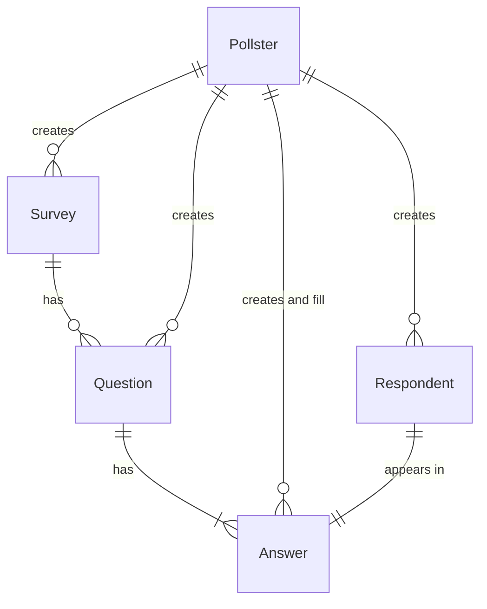

# Setup

In manage.py make sure that ``ENV='.env.dev'``.

## Virtual Environment

Create a python venv using
```sh
python -m venv <venv>
```
Enter the virtual environment
```sh
source <venv>/bin/activate
```
Install the necessary dependencies
```sh
python -m pip install -r requirements.txt
```

## Django

Start by performing migrations
```sh
python manage.py makemigrations
python manage.py migrate
```
Run the application in development mode
```sh
python manage.py runserver
```

# Models


